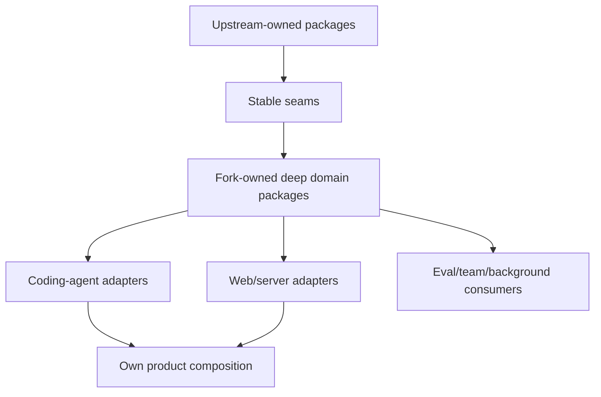
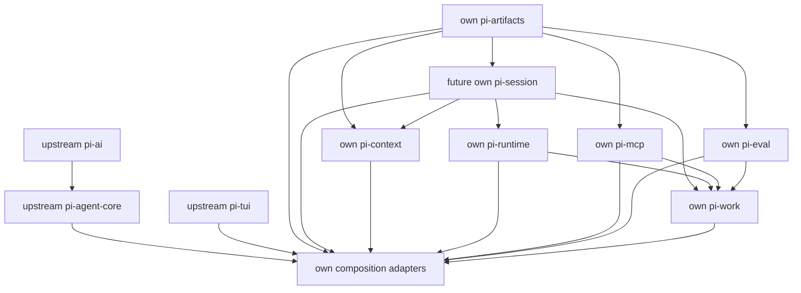

# 独立 Package 边界与 Upstream 同步策略研究

- 状态：架构与维护策略建议
- 更新日期：2026-07-31
- 范围：fork-owned modules、package extraction、命名与发布、依赖方向、upstream merge/rebase 策略、冲突度量与迁移顺序
- 核心结论：推荐“upstream-compatible core + fork-owned domain packages + 薄 composition adapters”，但**不建议每一个 feature 都建立一个 package**。Package 只在形成深 module、稳定 interface、第二消费者或两个真实 adapters 后提取；减少冲突的关键指标是修改 upstream-owned lines 的数量，而不是 package 数量

## 1. 当前事实基线

### Fork 身份

当前仓库：

- fork：`codelonesomest/pi`；
- parent/upstream：`earendil-works/pi`；
- 当前只配置了 `origin` remote；
- 2026-07-31 检查时 fork `main` 相对 upstream `main` 为 ahead 0、behind 5；
- 本次研究档案尚是工作区内容，不代表已提交的 fork divergence。

因此现在仍是建立长期同步结构的最佳时间：产品能力尚未大量写入 upstream 热点。

### 当前 workspace/package 图

当前发布模块：

```text
@earendil-works/pi-ai
        ↓
@earendil-works/pi-agent-core
        ↓
@earendil-works/pi-coding-agent ← @earendil-works/pi-tui
        ↑
@earendil-works/pi-server

@earendil-works/pi-protocol ← @earendil-works/pi-client
@earendil-works/pi-storage-sqlite-node → ai + agent-core
```

本地源代码规模粗略基线：

- `coding-agent` 约 56k lines；
- `ai` 约 22k；
- `tui` 约 14k；
- `agent` 约 11k；
- 其他 package 较小。

`coding-agent` 是最可能与 upstream 高频重叠的 composition/product package，也是 fork feature 全部堆进去后冲突最集中的地方。

## 2. Package 不能自动消除 Git Conflict

把代码放进新 package 只有在以下条件同时成立时才降低冲突：

1. 新文件路径不被 upstream 使用；
2. package 通过稳定 public interface 消费 upstream；
3. upstream composition root 只需要很少的 wiring；
4. 不 import upstream private/internal paths；
5. 不复制 upstream implementation；
6. build、settings、session、protocol 等共享 schema 不需要在多个 upstream 文件反复修改。

反例：建立 `@own/pi-agent`，但仍要修改 `agent-session.ts`、`interactive-mode.ts`、settings、keybindings、session manager 和 extension runner 才能工作。此时只是把一部分 implementation 移走，真正的 conflict surface 没有缩小。

应度量：

```text
upstream conflict surface
= fork 修改的 upstream-owned files
+ 修改行/附近 churn
+ private APIs consumed
+ composition touch points
+ generated/lockfile churn
```

不是：

```text
package count
```

## 3. 推荐总体形态：Mirror + Seams + Overlay



三类 ownership 必须明确：

### A. Upstream-owned

尽量保持与 `earendil-works/pi` 文件结构和 implementation 接近：

- `packages/ai`；
- `packages/agent` 的通用 loop/harness primitives；
- `packages/tui` 的通用 terminal primitives；
- upstream coding-agent 能力。

Fork 可以修 bug 或增加通用 seam，但每个修改都应能解释为什么不能只放在 overlay。

### B. Fork-owned domain packages

路径与 package 名由 fork 独占，upstream 不会自然修改：

- history；
- context/memory；
- work orchestration；
- MCP；
- eval runtime；
- reliability supervisor。

它们依赖 upstream 的稳定 seams，而不是反过来。

### C. Fork-owned composition/adapters

- own CLI/app entry；
- coding-agent extension/adapter；
- TUI screens；
- local web review/kanban server；
- settings registration。

Composition code可以依赖所有 domain packages，但不能被 domain packages依赖。

## 4. 不推荐的两个极端

### 极端 A：所有功能继续直接写进 `packages/coding-agent`

优点：

- 初期最快；
- 可直接访问所有内部对象；
- 少 package/build 配置。

问题：

- 冲突集中在 upstream 最活跃 package；
- domain contracts 与 TUI/Node/session 纠缠；
- headless/server/team 无法复用；
- 后续再抽离成本更高；
- upstream 同步需要理解整个产品改动。

只适合一次性小 UX change，不适合这份 roadmap。

### 极端 B：每个 feature 一个 package

例如 `pi-retry`、`pi-redo`、`pi-tool-card`、`pi-plan-comments`、`pi-agent-mailbox`。

问题：

- interface 总复杂度接近 implementation，形成 shallow modules；
- 版本、exports、README、changelog、build、lockfile、release 成本放大；
- 大量 package 只存在一个 consumer，seam 是假设而非事实；
- cross-package type changes 造成 change amplification；
- 很容易形成循环依赖；
- fork sync 仍要修改 composition root。

功能文件夹可以独立，npm package 不必独立。

## 5. Package 提取门槛

一个 module 满足多数条件后才提取为 package：

1. **明确 domain**：能用一个稳定名词描述，不是 UI 动作；
2. **深 module**：小 interface 隐藏大量规则/状态机/错误语义；
3. **真实 seam**：已有第二 consumer，或至少两个 concrete adapters；
4. **依赖向内**：不需要 TUI、Node、provider SDK、coding-agent internals；
5. **独立验证**：interface 是清晰 test surface；
6. **稳定生命周期**：不会每周与 composition schema 一起破坏；
7. **可独立 ownership**：upstream sync 时能判断该路径完全属于 fork；
8. **发布理由**：若 public publish，确有外部 consumer；否则可先 workspace-private。

经验规则：**one adapter = hypothetical seam，two adapters = real seam**。首版可以先在已有 package 内建立 module seam，第二 adapter出现后再移动文件。

## 6. Package 命名策略

用户举例 `@own/pi-agent`。这里建议把 `@own` 当概念占位符，实际 npm scope 在决定发布身份后再定；不要在尚未拥有/配置 scope 时写死。

### 不立即全量重命名 upstream packages

把所有 `@earendil-works/pi-*` imports 改成 `@own/pi-*` 会产生：

- 几乎全仓机械 divergence；
- package-lock/shrinkwrap/release script churn；
- docs/examples/generated artifacts冲突；
- 每次 upstream sync 都有无价值 rename noise。

短期保留 upstream package identity，own product 通过 fork-owned scope/package 引入 overlay。等产品需要公开发布完整替代发行版时，再做一次有计划 clean cutover。

### 避免 `@own/pi-agent` 歧义

当前已有 `pi-agent-core`。若 `pi-agent` 实际承载 subagent/team/goal，会让调用者无法判断它是低层 agent loop 还是 orchestration。

建议用 domain 名：
- `@own/pi-artifacts`；

- `@own/pi-session`；
- `@own/pi-context`；
- `@own/pi-work`；
- `@own/pi-mcp`；
- `@own/pi-eval`；
- `@own/pi-runtime`。

最终 umbrella/product 可叫 `@own/pi` 或 own CLI 名。Domain 名比“feature”“manager”“utils”更稳定。

## 7. Roadmap 到 Domain Package 的归属

### 7.2 `@own/pi-context`（强候选）

应包含：

- context ledger；
- token budget/context plan；
- compaction strategy contract；
- classic/continuous compartments；
- reduction/search/expand/memory contracts。

Adapters：provider tokenizer、historian model、SQLite/embedding、TUI diagnostics。

当前 classic compaction 可先 adapter-wrap，不应先重写。消费者至少有 interactive agent、subagent/eval/team。

相关专题：10。

### 7.3 `@own/pi-work`（先深 module，后 package）

建议先把以下作为同一个 work orchestration domain，而不是五个小包：

- `AgentDefinition` 与 role/capability ceilings；
- plan/version/review/approval；
- goal/task/dependency/lease/receipt；
- team member/mailbox/coordination；
- feedback/block/retry generation。

风险：范围很大。内部可分 modules：

```text
work/definitions
work/plans
work/goals
work/tasks
work/teams
```

只有当 plan 或 agent-definition 被独立外部 consumer使用时再分 package。`@own/pi-agent` 不建议用来装整个 domain。

相关专题：04、05、11、12。

### 7.4 `@own/pi-runtime`（强候选，但晚于 session）

应包含：

- durable operation/attempt model；
- failure taxonomy；
- retry/fallback/circuit-breaker policy；
- recovery reducer/supervisor；
- process/task lifecycle contract。

Node process、provider、MCP、tool、team 是 adapters。不能拆成 `pi-retry`、`pi-watchdog`、`pi-fallback`。

相关专题：13。

### 7.5 `@own/pi-mcp`（真实独立 package 候选）

MCP 有独立标准、transport、auth、capability negotiation、server manager 与 protocol tests，也会被 coding-agent、server、eval、team消费。适合独立 package：

- MCP client/server domain；
- connection lifecycle；
- tool/resource/prompt normalization；
- remote task/reconciliation；
- config schema。

stdio/HTTP/OAuth/Node process是 adapters；UI不进入 package。

相关专题：08、09。

### 7.6 `@own/pi-eval`（真实独立 package 候选）

持久 kernel、cell/artifact、tool bridge、budget、isolation有独立 lifecycle；可被 interactive agent、subagent、evaluation runner消费。Python/Bun process实现作为 adapters/optional dependencies。

相关专题：06。

### 7.7 留在现有 package 的能力

#### Tool UI/UX

- generic view primitives → `pi-tui`（若可 upstream）；
- coding-agent tool cards/details → coding-agent adapter；
- tool domain status/result contract → agent/core seam；
- 不建 `pi-tool-ui`，除非 web/TUI 共用 headless presentation model。

#### IDE chat editor

- editor engine已有 `pi-tui` ownership，先深化内部 module；
- session composer/context refs在 coding-agent adapter；
- browser editor出现且共享同一 headless document model后，才考虑 `@own/pi-editor-core`。

#### Settings UI

- setting registry/schema可属于 own composition/core config module；
- TUI/web各自 adapter；
- 不建 settings package，除非多个 products共享 schema/migration/validation。

#### Tool discovery

- catalog/search/activation contract可先在 agent/coding-agent seam；
- MCP/skills/providers分别提供 descriptors；
- 不建 `pi-discovery` 直到至少 MCP、skills、tools 三类 adapter共享稳定索引。

## 8. 推荐依赖方向



更严格地说，domain packages尽量依赖共享的极小value types，而不是互相随意import。

禁止：

- domain → coding-agent/TUI/server；
- upstream core → fork package（这会让 upstream mirror难同步）；
- MCP/eval/context互相循环；
- importing `packages/coding-agent/src/core/...` private paths；
-共享一个巨型 `common`/`utils` package。

## 9. Upstream Seam 策略

Fork feature需要 core hook时按优先级处理：

1. **现有 public interface/extension hook**；
2. **fork-owned adapter/composition**；
3. **向 upstream贡献通用 seam**；
4. **极小 fork patch**，记录原因、owner、removal condition；
5. 最后才是重写 upstream implementation。

一个好 seam：

- generic，不包含 own feature名称；
- callback/event/schema稳定；
-不会迫使 upstream core依赖 fork package；
-有 upstream本身可解释的用例；
-错误、ordering、cancellation contract明确；
-修改点小且有 interface-level tests。

例如 session persistence adapter、context strategy、tool presentation event、settings contributor、resource scheme resolver、operation lifecycle hooks，通常比在各 feature里 monkey patch 更好。

## 10. Fork 分支与 Remote 策略

建议添加只读 upstream remote：

```text
origin    codelonesomest/pi
upstream  earendil-works/pi
```

分支角色：

```text
upstream/main       remote truth
mirror/upstream     exact fast-forward mirror（无 own commits）
main                own product/release history
sync/upstream-<date> temporary integration branch
feature/*           own feature branches
```

### 为什么保留 mirror

- 快速比较真实 upstream，不受 own merge commits影响；
- CI 可构造 conflict/churn report；
-可生成 patch queue或测试 clean overlay；
-不会把 GitHub fork 的“Sync fork”操作误当成产品 integration。

`mirror/upstream` 只能 fast-forward，绝不放 own commits。

## 11. Merge 还是 Rebase

### Published/shared `main`

推荐定期把 upstream release/tag 或明确 commit **merge** 到 `main`：

- 不重写已发布 fork history；
-一次 sync 有明确审计边界；
-能保留 upstream ancestry；
-冲突解决集中在 integration PR；
-rollback可针对 merge/integration。

### Local/尚未发布 patch stack

可在临时 `sync/upstream-*` branch rebase own atomic commits到新 upstream，用于：

-测量哪些 patches仍必要；
-发现 patch能否删除/上游已实现；
-生成清晰 conflict inventory；
-重排/合并尚未公开的实验 commits。

不要反复 rebase 已共享 `main`。Git 文档明确 rebase会重放 commits；对已公开 history需谨慎。

### `rerere`

Git `rerere` 可记录并复用相同 conflict resolution。适合长期 fork的重复热点，但它只是辅助：

- resolution仍需 review；
- upstream semantics变化时旧 resolution可能不再正确；
- CI/verify不可省略；
-不要让 rerere掩盖应该删除的 fork patch。

## 12. Upstream Sync Runbook

每次同步：

1. fetch `upstream`；
2. fast-forward `mirror/upstream`；
3. 阅读 upstream changelog/release notes与迁移；
4. 建 `sync/upstream-YYYYMMDD` from `main`；
5. merge目标 upstream commit/tag；
6. 生成 conflict inventory，按 ownership分类；
7. 对每个 fork patch判断：drop、replace with upstream、adapt、keep；
8. 只在 own 修改的文件解决 conflict；未知/非 own区域单独 review；
9. 运行 package-specific checks，再跑仓库规定 `npm run check`；
10. smoke test own CLI 的高风险 flows；
11.记录 upstream base、conflicts、removed patches、behavior changes；
12. merge integration PR到 `main`。

不要只以“Git merge clean”判断成功。API/behavioral conflict可以完全无 textual conflict。

## 13. Fork Patch Manifest

建议维护 machine-readable manifest（未来实现，不在本研究阶段创建）：

```ts
interface ForkPatchRecord {
  id: string;
  domain: string;
  upstreamFiles: string[];
  reason: string;
  owner: string;
  introducedAtUpstream: string;
  removableWhen?: string;
  upstreamIssueOrPr?: string;
  verification: string[];
}
```

用途：

- 列出所有修改 upstream-owned files的原因；
- sync时逐项审查；
-测量 conflict surface；
-促使通用 seam回馈 upstream；
-防止无 owner 的 permanent patch。

Fork-owned package文件不逐个登记；manifest只管 upstream surface与composition touch points。

## 14. Conflict Budget 与 CI

建议指标：

- upstream-owned modified file count；
- modified lines/churn；
- private import count；
- patch manifest item count；
- sync conflict count/resolution time；
- own packages反向被 upstream core依赖的次数（目标 0）；
- upstream check + own acceptance pass rate。

CI policy 可逐步加入：

1. 禁止 fork packages import coding-agent private source；
2. 禁止 dependency cycles；
3. 检查 package export maps；
4. 检查 upstream patch manifest覆盖；
5. 在 mirror base上构建 clean overlay；
6. 周期性 dry-run merge/rebase报告 upcoming conflicts；
7. lockfile/generated变化单独 review。

不要把“零 upstream changes”设为绝对目标。少量高杠杆 seams 比复杂 monkey patch/复制 implementation 更易维护。

## 15. 版本与发布

当前 repo lockstep versioning 是 upstream规则。Fork初期建议：

- own workspace packages先 `private: true`；
-不急于 publish 每个 domain；
- composition product完成前继续单 repo/单 lockfile；
- public package出现外部 consumer后才稳定 semver/exports；
- own package version可先跟 product lockstep，减少 release matrix；
-若未来独立发布周期确有价值，再拆 release train。

直接 external deps继续 exact pin；optional runtimes（MCP transports、Python/Bun adapters等）避免拖进所有 consumers。

## 16. 推荐目录演化

### 阶段 0：现在

```text
packages/agent/...                  upstream-compatible seams
packages/coding-agent/...           thin adapters/composition
packages/<own-domain>/...            fork-owned workspace package
```

新 package路径必须明显属于 fork；如果仍使用 `packages/*`，README/package metadata说明 ownership。未来可考虑 `packages/own/*`，但这需要改变 workspace/build/release scripts，未必值得仅为视觉分组制造 divergence。

### 阶段 1：先建 module，不先建 package

在现有 `packages/agent` 或 fork composition内建立 pure domain folder与明确 exports；证明 interface后移动到新 package。移动应由 tooling/LSP更新 import，一次完成，不留兼容 alias。

### 阶段 2：提取已证明的深 packages

推荐顺序：

1. `pi-context`；
2. `pi-runtime`；
3. `pi-mcp` / `pi-eval`（按最先实现的vertical slice）；
4. `pi-work`（在plan/task/team contracts验证后）。

不是一次创建六个空scaffold。

## 17. 各专题 Package 决策表

| 专题 | 首期归属 | 独立 package 建议 |
|---|---|---|
| Tool UI/UX | coding-agent + tui primitives | 否 |
| IDE chat editor | `pi-tui` editor module + app adapter | 暂否 |
| Subagents/frontmatter | work/definitions module | 暂不单拆 |
| Agent teams | work/teams + runtime adapters | 与 work 同域 |
| Eval | eval domain | **是** |
| Settings UX | composition registry + UI | 否 |
| Tool/MCP/skill discovery | catalog module；providers adapters | 第二消费者后评估 |
| Built-in MCP | MCP domain | **是** |
| Context compaction | context domain | **是，首批** |
| Plan/web review | work/plans + web adapter | 不单建 plan-web core |
| Goal/Kanban | work/goals/tasks + web adapter | 与 work 同域 |
| Reliability/unattended | runtime domain | **是，首批后段** |
| Undo/Redo | session/history + workspace adapter | 不单建 undo package |

## 18. Architecture Decision Rules

实施每个 vertical slice 前回答：

1. 这段代码的 owner 是 upstream 还是 fork？
2. 能否通过现有 public seam实现？
3. 新 seam是否通用且够深？
4. module删除后复杂度会消失还是散到 callers？
5. 是否已有第二 consumer/two adapters？
6. 是否会让 upstream core反向依赖 fork？
7.需要改哪些 upstream files？能否缩成一个 composition touch point？
8. session/protocol schema如何迁移？
9.独立 package会减少还是增加 release/interface成本？
10.这项 patch何时可以从 fork删除？

## 19. 验收场景

1. 新 domain package可在不启动 TUI 的情况下验证；
2. coding-agent仅通过 public exports消费；
3. upstream core不依赖 own packages；
4. sync upstream时 fork-owned paths无 textual conflicts；
5. composition冲突集中且有 manifest owner；
6. upstream新增相同能力时可删除 adapter/patch而非双实现；
7. package没有只有 pass-through exports 的 shallow interface；
8. package graph无 cycles；
9. package可选 runtime不污染所有 installs；
10. sync后 upstream behavior与 own acceptance均 smoke-tested；
11. published main不因 rebase被重写；
12. redo/session/context等共享 value types 时没有复制 schemas；
13.新 feature不需要每次编辑多个 upstream hotspots；
14. package命名不与 `pi-agent-core`等既有概念歧义。

## 20. 推荐结论

**应该独立 package，但按 domain，而不是按每一个 feature。**

最优维护形态不是“完全不碰 upstream”，也不是“所有东西 fork 内改写”，而是：

- upstream packages尽量保持可同步；
- fork只贡献少量高杠杆 seams；
-复杂 state machines放入 fork-owned deep modules/packages；
- TUI/web/CLI只是 adapters；
-用 patch manifest和 conflict budget持续衡量真实 divergence；
-定期 integration，而不是积累半年后一次大 merge。

`@own/pi-agent` 作为例子方向正确（使用own scope隔离ownership），但具体package不建议用这个模糊名字承载所有新能力。当前优先`pi-artifacts`，其后按实证评估`pi-context`、`pi-runtime`、`pi-mcp`、`pi-eval`、`pi-session`与`pi-work`。

## 21. 资料来源

### 本仓库

- root workspaces/build/release：`package.json`
- current package metadata：`packages/*/package.json`
- package exports：`packages/agent/package.json`、`packages/coding-agent/package.json`
- architecture baseline：`packages/agent/docs/durable-harness.md`
- protocol boundary：`packages/protocol/README.md`
- fork identity：GitHub `codelonesomest/pi` parent metadata

### Git / GitHub

- GitHub fork synchronization：https://docs.github.com/en/pull-requests/how-tos/work-with-forks/syncing-a-fork
- Git rebase：https://git-scm.com/docs/git-rebase
- Git rerere：https://git-scm.com/docs/git-rerere
- Git format-patch：https://git-scm.com/docs/git-format-patch

### 相关专题

- Agent teams：`../05-agent-teams/research.md`
- MCP：`../09-built-in-mcp/research.md`
- Context：`../10-context-compaction/research.md`
- Goal/Kanban：`../12-goal-kanban/research.md`
- Reliability：`../13-reliability-and-unattended/research.md`
- Undo/Redo：`../15-session-undo-redo/research.md`
