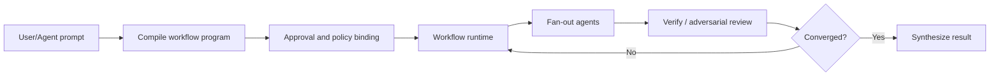
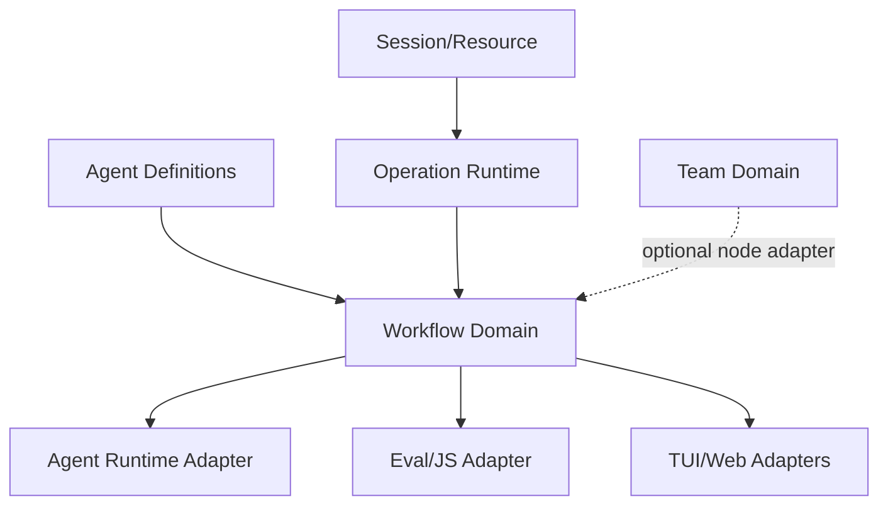

# Dynamic Workflows 与 Graph Orchestration 研究

- 状态：架构方向建议，尚非实施承诺
- 更新日期：2026-08-01
- 范围：由模型生成、由 runtime 执行的可检查、可复用、可恢复多 agent 工作流；覆盖 fan-out/fan-in、pipeline、循环、验证与后台运行
- 核心结论：Dynamic Workflow 应成为与 Subagent、Agent Team 并列的第三种 orchestration primitive；它复用统一 agent runtime 与 operation substrate，但由版本化程序而不是主 agent 或 team lead 持有控制流

## 1. 为什么值得成为独立专题

当前复杂任务有三个不同问题，不能只靠增加 subagent 数量解决：

1. **一次委派**：把一个有界任务交给独立 context，完成后返回；
2. **持续协作**：多个长期 session 通过 task ledger、mailbox、lease 与人工介入共同完成目标；
3. **大规模程序化编排**：对几十到上千个同构或分阶段节点执行 map、reduce、循环、分支和验证，同时避免所有中间结果进入主 context。

前两者分别属于 Subagent 与 Agent Team。第三类需要 Dynamic Workflow。



“Graph Engineering”是社区对这种节点、依赖、循环和验证拓扑的称呼；不是 Anthropic 的正式产品名。本文使用 **Dynamic Workflow** 表示产品能力，使用 **workflow graph** 表示编译后执行拓扑。

## 2. 用户价值与适用边界

Dynamic Workflow 适合：

- 全仓 route、文件、package、issue 或数据项审计；
- 数百文件的机械迁移，加独立 review 与真实 oracle；
- profiler-guided optimization 或安全检查；
- 多来源研究、claim extraction、cross-check 与综合；
- 多方案独立设计、反驳、评审和收敛；
- “运行检查 → 按错误修复 → 重跑，直到通过或停止进展”的有界循环；
- 值得保存成项目命令的重复工程流程。

不适合：

- 一个 agent 一两轮就能完成的小任务；
- 工作节点高度共享可变状态、无法安全隔离；
- 没有可观察完成条件的开放式“继续改进”；
- 每一步都要求用户批准或交互式澄清的流程；
- 高副作用任务却没有幂等、补偿或人工 gate；
- 只是为了制造并发而把一个不可分任务切碎。

默认选择原则：

```text
single agent
  → 一个有界独立任务：subagent
  → 少量长期协作者与动态人工 steering：agent team
  → 可程序化、可批量、可验证的大规模拓扑：dynamic workflow
```

## 3. 当前 Pi / OMP 基线

仓库与当前 harness 研究已经具备可复用基础，但尚无正式 workflow domain：

- Subagent example 有 single、parallel、chain、streaming、abort 与 usage；
- OMP `task` 支持批量异步 subagent，`hub` 支持 peer 与 background job 生命周期；
- OMP Execution Eval 提供 `agent()`、`parallel()`、`pipeline()` 组合能力；
- Agent Team 研究定义 durable task ledger、mailbox、lease、worktree 与 review；
- Reliability 研究覆盖 operation identity、retry、reconcile、budget 与 watchdog；
- Existing research covers durable events and result references.
- Tool UI 与 Plan Review 可承载进度树、raw program、approval 与结果检查。

缺口是：

- versioned workflow program 与 compile/validate contract；
- 独立于 conversation context 的 workflow runtime；
- node dependency、attempt、cache/replay 与 checkpoint 语义；
- fan-out/fan-in 的 backpressure 和全局预算；
- workflow-level permission binding 与 side-effect policy；
- pause/resume/cancel/restart 的 durable state；
- workflow progress、node drill-down、save/reuse 与 provenance UI；
- 明确禁止 Eval、Team 和 Workflow 各自实现第二套 agent scheduler。

## 4. Claude Code Dynamic Workflows 的一手证据

Anthropic 于 2026-05-28 发布 Dynamic Workflows，之后更新为 generally available。官方文档截至 2026-08-01 说明：

官方文档要求 Claude Code v2.1.154 或更高版本；当前覆盖付费方案、Anthropic API、Amazon Bedrock、Google Cloud Agent Platform 与 Microsoft Foundry，Pro 用户需从 `/config` 开启。版本与方案属于外部 support boundary，Pi 设计只借鉴机制，不与其 entitlement 耦合。

- Claude 根据用户任务生成 JavaScript orchestration script；
- runtime 在后台执行，主 session 保持可响应；
- 中间结果保存在脚本变量，而不是持续进入主 conversation context；
- 适用于几十到数百 agent 的审计、迁移、研究与多角度 plan；
- workflow 可以保存到项目或用户目录，之后作为 slash command 重跑；
- `/deep-research` 是内置工作流；
- `ultracode` 可让 Claude 自动判断何时生成 workflow；
- 运行可在同一 session 内 pause/resume；
- workflow program 本身不直接访问 filesystem/shell，side effect 由受权限控制的 agent 执行；
- 官方当前 runtime 同时最多 16 agents，单次最多 1,000 agents；
- 大规模运行会显著提高 token 使用量，并提供 size guideline 与 large-workflow warning；
- 运行中没有普通 user input，阶段性人工 sign-off 需要拆成多个 workflow。

这些是 Claude Code 当前实现事实，不应直接冻结成 Pi 的永久 wire contract。值得借鉴的是：

1. control flow 移入可执行程序；
2. program 在运行前可检查和批准；
3. orchestration 可保存、重跑和分发；
4. intermediate state 不污染主 agent context；
5. verification 是图的一部分，而不是结束时一句“请检查”；
6. 运行有独立进度、成本与恢复 surface。

需要改进或先验证的部分：

- “同一 session 内恢复”不足以满足 host restart 与长期 unattended；
- script variables 若只在进程内，不能成为 durable truth；
- 大规模写任务必须有更清楚的 workspace ownership 与 integration contract；
- model-generated code 的 trust、版本、权限和重放风险必须显式；
- agent count guideline 不能替代 token、cost、wall time、side-effect 与 artifact budgets。

## 5. 与 Subagent、Agent Team、Execution Eval 的边界

| 维度 | Subagent | Agent Team | Dynamic Workflow | Execution Eval |
|---|---|---|---|---|
| 控制者 | parent agent 逐轮决定 | lead/peer + task ledger | versioned workflow program | cell author / running code |
| 生命周期 | 一次有界 run | 多个长期 session | 一个有开始、节点图、终态的 run | 持久 kernel 中的一个或多个 cells |
| 中间状态 | parent/child context + receipt | ledger/mailbox/session | workflow variables + durable node receipts | kernel memory + cell/output receipts |
| 典型规模 | 少量委派 | 少量长期成员 | 数十至上千 node attempts | 数据/代码探索，通常单用户 runtime |
| 人工交互 | 返回后继续 | 可随时进入 teammate | 通常在 run 前后或 stage gate | cell 之间交互 |
| 可重复对象 | agent definition | team/task policy | orchestration program | notebook/cell code |
| 核心优势 | context isolation | collaboration/ownership | scale/repeatability/verification | arbitrary computation/tool composition |

关键 ownership：

- **Subagent runtime** 唯一拥有 agent spawn、turn、tool、usage 与 result contract；
- **Agent Team** 唯一拥有 member roster、mailbox、task claim/lease 与长期 peer coordination；
- **Dynamic Workflow** 只拥有 program、graph、node dependency、scheduling intent、checkpoint 与 aggregate result；
- **Execution Eval** 只拥有 kernel/cell/runtime state；它可作为 workflow authoring/execution adapter，但不能拥有第二套 workflow truth；
- **Reliability runtime** 统一拥有 operation lifecycle、cancel、timeout、budget、retry/reconcile 基础设施。

Workflow 可以用 subagent 做 node，也可以让某个 node 启动或调用 team，但首版应禁止任意嵌套递归。Team 内也可以请求 workflow 处理批量子任务，但 workflow 不能伪装成有 mailbox 和持续人格的 teammate。

## 6. 建议概念模型

```ts
interface WorkflowDefinition {
  schema: "own-pi-workflow/v1";
  identity: WorkflowIdentity;
  source: WorkflowSource;
  program: string;
  inputContract?: JsonSchema;
  outputContract?: JsonSchema;
  policy: WorkflowPolicy;
}

interface WorkflowRun {
  id: WorkflowRunId;
  definition: { id: WorkflowId; digest: string };
  input: string | JsonValue;
  status: WorkflowRunStatus;
  graph: WorkflowGraphRef;
  policySnapshot: WorkflowPolicySnapshot;
  budget: WorkflowBudgetState;
  result?: string | JsonValue;
  failure?: StructuredFailure;
}

type WorkflowRunStatus =
  | "draft"
  | "awaiting_approval"
  | "queued"
  | "running"
  | "pausing"
  | "paused"
  | "succeeded"
  | "failed"
  | "cancelled"
  | "interrupted";
```

每个 node attempt 需要：

```ts
interface WorkflowNodeAttempt {
  nodeId: WorkflowNodeId;
  attempt: number;
  kind: "agent" | "map" | "reduce" | "judge" | "gate" | "transform";
  dependencies: WorkflowNodeId[];
  status: NodeStatus;
  inputDigest: string;
  operationId?: OperationId;
  output?: string | JsonValue;
  failure?: StructuredFailure;
  usage?: Usage;
  startedAt?: string;
  finishedAt?: string;
}
```

`WorkflowDefinition` 是可复用定义；`WorkflowRun` 是一次 execution；`WorkflowGraph` 是程序在给定输入下 materialize 的运行拓扑。三者不能混为一个可变 JSON 文件。

## 7. Program 与 authoring model

### 7.1 首选：受限 TypeScript/JavaScript authoring surface

用户不应先学习完整 DSL。Claude 可以生成 TypeScript/JavaScript 子集，核心 primitive 保持很小：

```ts
const files = await agent("Discover target files", { output: fileListSchema });

const findings = await map(files, file =>
  agent(`Audit ${file}`, { isolation: "read-only" }),
  { concurrency: 8 },
);

const verified = await map(findings, finding =>
  agent(`Try to disprove this finding: ${finding}`, { role: "reviewer" }),
);

return reduce(verified, "Deduplicate and rank verified findings");
```

最低需要：

- `agent(prompt, options)`；
- `map(items, fn, options)` / bounded parallel；
- `sequence(...stages)`；
- `reduce(items, prompt/options)`；
- 有界 `while`/repeat-until；
- structured input/output schema；
- result-reference reads and writes；
- progress/log；
- budget/deadline 查询；
- 显式 stage gate。

### 7.2 不执行任意 host JavaScript

“JavaScript program”只表示 authoring ergonomics，不代表把项目提供的任意代码 `eval` 在主进程：

- 在 isolated worker/interpreter 中运行；
- 不暴露 raw `process`、filesystem、network、module loader 或 secrets；
- 只注入 capability bridge；
- static validation 拒绝 unsupported imports、dynamic code generation 和 unbounded constructs；
- sync infinite loop 必须可通过 worker termination 控制；
- program digest、compiler/runtime version 进入 receipt。

是否复用 Execution Eval 的 JS worker，是 implementation spike 问题；domain contract 不依赖具体 interpreter。

### 7.3 Program、graph 与 script variables

源程序可能根据前一阶段结果动态生成 node，因此运行前未必能得到完整静态 DAG。需要区分：

- source program：用户/模型可审查的控制逻辑；
- planned stages：批准前的人类可理解摘要；
- materialized graph：运行中已创建的 node 与 dependency；
- variable snapshot：继续执行程序需要的可序列化状态；
- node receipt：已经发生且不可伪造的执行事实。

UI 不应把 planned graph 冒充实际 graph。

## 8. Compile、approval 与执行生命周期

```text
prompt / saved command
→ model drafts source program + stage summary + estimated budget
→ parser/type/schema/static policy validation
→ bind exact agent definitions, models, permissions and budget ceilings
→ user/managed policy approval
→ create durable run + program digest
→ execute and materialize nodes incrementally
→ checkpoint serializable continuation + node receipts
→ verify aggregate output contract
→ publish final result and provenance
```

必须在开始前展示：

- workflow name/source/digest；
- planned stages 与可能 side effects；
- target workspace/isolation；
- agent/model/effort policy；
- concurrency 和 budget ceilings；
- tools/network/MCP 权限；
- stop/convergence condition；
- raw program 入口。

“Claude 生成了程序”不是授权。项目保存的 workflow 与 plugin workflow 都是 executable orchestration，必须保留 provenance 和 trust decision。

## 9. Scheduling、backpressure 与收敛

Scheduler 应是 shared runtime service，而不是 workflow interpreter 内部随意 `Promise.all`：

- 全局、session、workflow、provider 四级 concurrency；
- queue fairness，避免一个 500-node workflow 饿死交互式任务；
- bounded map，不一次创建全部 live agent process；
- provider rate limit 和 machine capacity backpressure；
- per-stage model/effort routing；
- result size/artifact spill；
- cancel 从 workflow → node → agent/tool operation 传播；
- fan-in 只接收 validated result，不接收任意 transcript blob。

循环必须有至少一个硬停止条件：

- maximum rounds/attempts；
- wall deadline；
- token/cost budget；
- no-progress rounds；
- oracle passed；
- minimum confidence/convergence rule。

禁止只有自然语言“直到完成”为停止条件。

## 10. 写操作、隔离与 integration

大规模读取容易并行，大规模写入不是。建议支持三种明确模式：

1. **read-only fan-out**：所有 node 共享 checkout，只读；
2. **partitioned writes**：编译阶段证明 disjoint `allowedFiles`，每 partition single writer；
3. **isolated candidates**：每 node 在 worktree/copy 中修改，由 integration stage review/apply。

不应默认让数十 agent 同时写共享 checkout。即使文件不同，也可能竞争 lockfile、generated output、formatter、build cache 或 shared config。

Integration 必须是显式 node/stage，持有：

- base revision/workspace digest；
- candidate patch refs；
- ownership contract；
- merge order；
- conflict result；
- verification oracle；
- apply/rollback receipt。

首个 vertical slice 应为 read-only audit；不要用大规模写迁移作为 runtime 的第一份证明。

## 11. Durability、pause/resume 与 replay

Canonical truth 是 workflow events + node/operation receipts，不是进度 UI，也不是 interpreter heap。

建议事件至少包括：

```text
workflow.created
workflow.approved
workflow.started
node.materialized
node.started
node.completed | node.failed | node.cancelled
checkpoint.committed
workflow.paused | workflow.resumed
workflow.succeeded | workflow.failed | workflow.cancelled
```

Checkpoint commit ordering：

```text
validate node result
→ persist result/artifact
→ append node completion receipt
→ persist serializable continuation/checkpoint
→ commit authoritative workflow head
→ publish progress snapshot
```

恢复规则：

- committed node output 可按 input/program/policy digest reuse；
- running 但无 completion receipt 的 node 进入 interrupted/reconcile；
- read-only/idempotent node 可按 policy 重跑；
- unknown side effect 不自动重跑；
- continuation 无法兼容新 runtime 时 fail closed，并允许从最近 stage boundary 重启；
- program definition 更新不改变已启动 run 的 snapshot；
- resume 使用原 program digest、agent definition digest 和 policy snapshot；
- 用户选择“用新版本重跑”必须创建新 run identity。

需要有限 spike 比较两种路线：

1. interpreter continuation 序列化；
2. workflow 编译为显式 state machine/event-sourced continuation。

没有 host-restart 证据前，不承诺“任意代码位置精确续跑”。首版可以只在 stage boundary durable resume，但必须诚实显示已保留和将重跑的节点。

## 12. Cache、deduplication 与 determinism

Node cache key 至少包括：

- program/definition digest；
- node identity + attempt policy；
- normalized input digest；
- agent definition digest；
- exact model/provider/effort；
- tool/capability/policy digest；
- relevant workspace/source revision；
- declared external resource versions。

模型输出不是 deterministic。Cache 表示“复用同一次已完成 execution receipt”，不是声称相同输入总会得到相同结果。

默认只复用同一 paused/resumed run 内的 completed nodes。跨 run cache 必须由 workflow author 显式标记 node 为 replay-safe，并处理 stale workspace、web data 和 credentials。

## 13. Verification 不是装饰节点

Workflow 的价值来自结构化质量拓扑，而不是 agent 数量。建议内建模式：

### Map → verify → reduce

每个 finding 独立核实；只有 verified 或明确 unverified 的结果进入汇总。

### Independent attempts → judge

多个 agent 不共享前一答案，judge 看到 anonymized outputs 和 objective rubric。

### Implement → oracle → fix loop

真实 typecheck/test/benchmark 是 oracle；agent 自报“完成”不能关闭 loop。

### Discover → saturation

多轮寻找新项，连续 N 轮无新增时停止；dedupe key 与 coverage boundary 必须明确。

Verifier failure、rate limit 与 finding refuted 必须是不同状态。不能把“未验证”算成“已反驳”，也不能因 verifier 自身失败将 finding 静默丢弃。

## 14. Permission、trust 与安全

- workflow program permission 是所有 node 的 ceiling；
- node/agent definition 只能进一步收紧，不能提升；
- managed/user deny 始终胜过 project/plugin allow；
- workflow agent 不能代替用户批准敏感操作；
- stage gate 必须绑定 program digest、input scope 与 prior result digest；
- raw prompt、web/MCP/tool output 都是 untrusted data，不得改变 control plane；
- program 生成与 program 执行是两个 actor/event；
- saved project/plugin workflow 首次运行需 trust，变更 digest 后重新评估；
- secrets 默认不进入 script variables、node prompts、logs 或 artifacts；
- dynamic path、URI 和 schema 必须 validation；
- resource authorization 留在 composition/runtime adapter。

Side-effect taxonomy 至少区分：

- pure/read-only；
- idempotent write；
- reversible write；
- externally reconciliable；
- unknown/non-idempotent。

最后一类失败后默认 blocked，等待人工处理。

## 15. Cost、容量与 policy

Workflow budget 应同时包含：

```ts
interface WorkflowBudget {
  maxNodes: number;
  maxConcurrentNodes: number;
  maxAgentTurns: number;
  maxInputTokens: number;
  maxOutputTokens: number;
  maxCost?: Money;
  deadline?: string;
  maxArtifactBytes: number;
  maxRetries: number;
  maxNoProgressRounds: number;
}
```

Size preset 只是生成建议，不是执行硬限制。runtime 在超限前应：

1. 停止 materialize 新 node；
2. 让已运行 node 到安全边界或取消；
3. commit checkpoint；
4. 转为 paused/blocked；
5. 显示 consumed、reserved、remaining 与继续所需授权。

不能静默降低 model、跳过 verifier 或缩小任务范围来“控制成本”。

## 16. TUI、Web 与 observability

折叠状态：

```text
Workflow · audit-routes · running
  verify  38/52 · 8 active · 4 failed · 412k tokens · 12m
```

展开层级：

```text
run
  → source program / approval / budget
  → stage
  → node
  → agent prompt / recent operations / result / usage / failure
  → artifact / verification provenance
```

操作：

- pause/resume；
- cancel workflow 或 selected node；
- retry safe node；
- 查看 raw program 与 materialized graph；
- 比较 planned/actual agent count 和 cost；
- save as project/user workflow；
- fork definition，而不是原地改写已运行 run；
- 从 final claim 跳转到 verifier 和 source receipts。

TUI 与 Web 消费同一 authoritative snapshot/command API。UI 不直接编辑 event store，也不能把“隐藏失败 node”变成逻辑成功。

Telemetry 应支持：

- queue/run/wait duration；
- node/attempt/status counts；
- per-stage/model usage 与 cost；
- cache/replay hits；
- cancellation latency；
- no-progress/convergence；
- failed verifier、schema failure、permission wait；
- critical path 与 fan-out utilization。

## 17. 保存、分发与版本

建议位置沿用统一 discovery/scope，而不是复制 Claude Code 路径作为 wire contract：

- managed/org；
- session/one-shot；
- project-local；
- user；
- package/plugin。

Definition 至少包含：

```yaml
schema: own-pi-workflow/v1
name: audit-routes
description: Audit route authentication and independently verify findings
entry: ./audit-routes.ts
input: ./schemas/audit-input.schema.json
output: ./schemas/findings.schema.json
policy: ./policies/read-only-audit.yaml
```

规则：

- exact source + dependency digest 进入 run；
- unknown major version 拒绝；
- project definition 需要 trust；
- closest project scope 可以 override name，但 diagnostics 显示 shadow chain；
- plugin workflow namespaced；
- saved generated program 在用户确认后才成为 reusable definition；
- workflow 可以引用 AgentDefinition、Skill、MCP/profile，但不内嵌 credentials。

## 18. Package 与 dependency 建议

不要立即创建 `@own/pi-workflow` 空 package。先在 fork-owned deep module 建立 read-only vertical slice，证明至少两个 authoring adapters（例如 prompt-generated workflow 与 saved command）消费同一 domain contract。

长期 dependency 方向：



更精确地说，domain 层不能依赖具体 eval worker、TUI、git 或 provider：

- workflow domain：definition、run、graph、node、reducer、policy contract；
- runtime adapter：scheduler、worker、checkpoint、agent invocation；
- node adapters：agent、tool/oracle、team（后续）；
- authoring adapters：generated JS、saved command、plugin；
- UI adapters：TUI/Web/IDE；
- persistence：session/work operation store。

如果 workflow 和 eval 共用 JS worker，也只共用 execution infrastructure，不让 `EvalSession` 成为 workflow canonical owner。

## 19. 方案比较

### A. 只增强 Subagent parallel/chain

优点：最小实现、复用现有 example。

否决原因：control flow 仍在 parent context；难以表达动态循环、durable graph、checkpoint、保存重跑与大规模中间结果。

### B. 所有复杂任务都用 Agent Team

优点：已有 task ledger、人工 steering 与长期协作方向。

否决原因：为同构批处理创建长期 member/mailbox 成本过高；team lead 仍可能成为控制与 context 瓶颈；program repeatability 弱。

### C. 让 Execution Eval 脚本直接成为 workflow

优点：已有 `agent/parallel/pipeline` authoring ergonomics。

风险：kernel heap、cell lifecycle 与 durable workflow truth 混淆；任意代码与权限面过大；恢复语义不足。

选择：复用 Eval worker/tool bridge 的实现经验或 adapter，但建立独立 Workflow domain 和 receipt。

### D. 新建 declarative DAG DSL

优点：容易静态验证、可视化和恢复。

风险：动态 discovery、循环、条件和 aggregation 很快让 DSL 复杂；用户和模型需要学习第二种语言。

选择：首选受限 TypeScript/JavaScript authoring，编译/解释成显式 runtime state machine。若 spike 证明 continuation 无法安全持久化，再限制首版语法或引入较小 IR，而不是先设计庞大 YAML DSL。

## 20. 分阶段研究与实施建议

### Phase A：Research receipts 与 spikes

1. 完整映射当前 subagent example、OMP task/eval 和 durable operation seams；
2. 用 20–100 个 read-only fake/real agents 测 scheduler、backpressure 与 token accounting；
3. 比较 JS continuation 与显式 state-machine checkpoint；
4. 验证 process kill 后 completed node reuse、interrupted node reconcile；
5. threat-model generated/saved project program；
6. 确认两种 authoring adapter 共用同一 domain。

### Phase B：Read-only workflow vertical slice

- prompt 生成固定三阶段 workflow；
- raw program approval；
- bounded parallel agent map；
- structured outputs；
- independent verifier；
- pause/resume；
- final cited/provenance result；
- TUI progress drill-down；
- session restart 后从 stage boundary 恢复。

### Phase C：Reusable definitions 与 richer control flow

- save/project/user/plugin discovery；
- typed args；
- reduce/judge；
- bounded fix/discovery loops；
- size/cost presets；
- IDE/Web progress adapter；
- cross-run replay-safe cache（若有证据）。

### Phase D：Isolated writes 与 integration

- allowed-files partition；
- worktree/copy isolation；
- candidate patch artifacts；
- explicit integration/review node；
- real build/test oracle；
- conflict、rollback 与 partial apply recovery。

在 read-only slice 和 host-restart recovery 成立前，不宣传“数百 agent 自动迁移”。

## 21. Acceptance contracts

首个会失败的 observable scenario：

> 用户从真实 CLI 请求 workflow 审计一组 fixture files；运行并发 fan-out、独立验证、暂停并终止 host；重启后已 commit 节点不重跑，未完成节点按 read-only policy 重跑；最终只报告通过验证的 findings，unverified 与 refuted 明确区分，并可从每项结果跳转到 node/agent/source receipt。

必须覆盖：

1. invalid/unsupported program 在创建任何 side effect 前失败；
2. program approval 绑定 digest，修改后不能沿用旧批准；
3. concurrency 永不超过 effective policy；
4. global scheduler 对交互式操作保持公平；
5. malformed agent output 不进入 reduce；
6. verifier failure 不等于 finding refuted；
7. cancel 传播到 active node，停止 materialize 新 node；
8. budget 达到上限后 durable pause，不静默缩小范围；
9. host kill 后恢复只复用 committed node；
10. unknown/non-idempotent side effect 不自动 retry；
11. project workflow 不能提升 parent permission；
12. node result 超限 spill 到 artifact，resume 后仍可读；
13. saved definition 新版本不改变旧 run snapshot；
14. no-progress loop 在硬边界停止并给 diagnostic；
15. TUI 与 Web/IDE projection 对同一 run 状态一致；
16. read-only audit 的真实 CLI smoke test；
17. targeted tests、fault injection 与 `npm run check` 全部通过。

## 22. 开放决策

在 implementation 前通过 spike/receipt 关闭：

1. 首版是否只允许 static stage graph + bounded map，还是支持一般条件/循环；
2. program 使用 TypeScript strip-only、JavaScript，还是编译到自有 IR；
3. checkpoint 粒度是 node、stage 还是可序列化 continuation；
4. workflow state 归入统一 Work domain 还是独立 deep module；
5. host restart 后支持到何种精确 resume 语义；
6. workflow 是否能直接调用 tool/oracle，还是首版所有 side effect 都通过 agent；
7. 与 Agent Team 的允许嵌套方向和深度；
8. model-generated program 的默认 trust/approval UX；
9. 默认 concurrency、node count、token/cost 与 artifact budgets；
10. cross-run cache 是否有足够真实场景值得加入；
11. project workflow scope/override 是否与 AgentDefinition 完全统一；
12. 第一版支持哪些 OS/runtime/isolation matrix。

## 23. 资料来源

一手资料：

- Anthropic Dynamic Workflows 发布（2026-05-28，页面后续标注 GA）：https://claude.com/blog/introducing-dynamic-workflows-in-claude-code
- Claude Code Dynamic Workflows 文档（访问于 2026-08-01）：https://code.claude.com/docs/en/workflows
- Claude Opus 4.8 发布说明与 Dynamic Workflows 初始 research preview 描述：https://www.anthropic.com/news/claude-opus-4-8

本仓库相关研究：

- Subagent 与 Frontmatter：`../04-subagents-and-frontmatter/research.md`
- Agent Teams：`../05-agent-teams/research.md`
- Execution Eval：`../06-execution-eval/research.md`
- Reliability/Unattended：`../13-reliability-and-unattended/research.md`
- Implementation 研究门禁：`../90-research-governance/implementation-research-gate.md`
