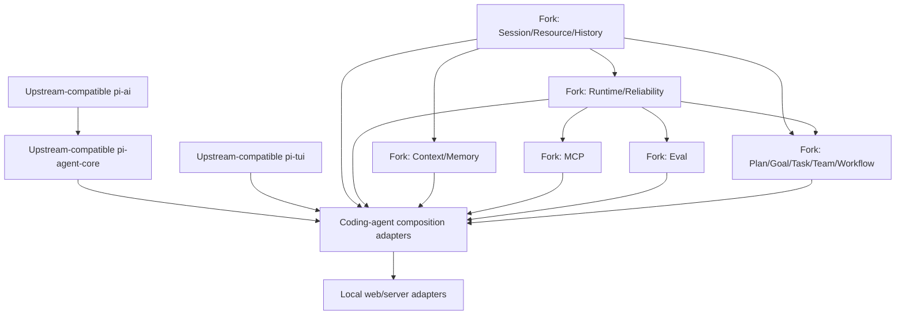

# Harness Evolution Research Archive

- 状态：研究归档完成，尚非实施承诺；`00` 的少数有界 adapter/diagnostic evidence 不构成 completed capability platform
- 更新日期：2026-08-05
- 范围：将当前 Pi fork 演进为长期维护、可恢复、可组合的自有 agent harness
- 原则：每个专题独立保存证据、现状基线、建议设计、风险、分阶段方案与验收场景；本文件只做索引与跨专题整合。`00` 是附着在 domain owner runtime seam 的薄联邦 status/explain overlay，不是 settings/policy/durable-domain owner 或 domain work 的先决 phase。
- 实施门禁：[Implementation 前研究门禁](90-research-governance/implementation-research-gate.md)

## 0. 目录约定

- `00-89-*`：按主题编号的长期研究档案；每个目录保存该主题的研究、决策记录与可删除的实验结论。
- `90-*`：跨主题的研究治理、门禁与对照资料。
- `docs/goals/`：GoalBuddy 的执行与审计记录，不是研究档案的一部分。

## 1. 为什么放在这里

`docs/research/` 是面向未来产品与架构决策的研究区：

- 不混入现有 package 的用户文档；
- 不把尚未决定的方向写成 ADR 或正式 specification；
- 每个 feature 有独立目录，后续可以继续加入 experiments、decision records 与 implementation plans；
- 本文件提供统一术语、依赖关系、package 方向与实施顺序。

研究档案明确区分：

1. **当前 Pi 已有能力**；
2. **外部项目可借鉴机制**；
3. **建议架构**；
4. **风险与非目标**；
5. **待实现/待验证内容**。

## 2. 专题索引

| # | 专题 | 核心问题 | 研究档案 |
|---|---|---|---|
| 01 | Tool UI/UX | 如何把 tool call/result 从调试文本变成高信息密度、可折叠、可操作的运行视图 | [research](01-tool-ui-ux/research.md) |
| 02 | IDE 级聊天编辑器 | 如何支持 selection、mouse、context refs、completion、多草稿与可访问交互 | [research](02-ide-chat-editor/research.md) |
| 04 | Subagents 与 Frontmatter | 如何统一 Claude Code、Codex、OpenCode、OMP 风格 agent definition、权限与结果协议 | [research](04-subagents-and-frontmatter/research.md) |
| 05 | Agent Teams | 如何实现 durable task ledger、mailbox、ownership、worktree、review 与团队协调 | [research](05-agent-teams/research.md) |
| 06 | Execution Eval | 如何提供持久 JS/Python kernel、artifact、tool bridge、隔离、预算与并行 DAG | [research](06-execution-eval/research.md) |
| 07 | Settings UI/UX | 如何把分散设置变成可搜索、可解释、可预览、可诊断的信息架构 | [research](07-settings-ui-ux/research.md) |
| 08 | Tool/MCP/Skill Discovery | 如何按需搜索、加载与卸载 optional tools、MCP、skills，控制 schema/context 成本 | [research](08-tool-discovery/research.md) |
| 09 | Built-in MCP | 如何内置 MCP client/server、transport、auth、capability negotiation 与 remote task lifecycle | [research](09-built-in-mcp/research.md) |
| 10 | Context Compaction | 如何同时保留可靠 classic summary 与 Magic Context 式 continuous compartments、reduction、search/expand | [research](10-context-compaction/research.md) |
| 11 | `/plan` 与网页评审 | 如何把 plan mode、versioned artifact、anchored comments、approval 与执行 handoff 连成闭环 | [research](11-plan-web-review/research.md) |
| 12 | Work Ledger 与 Kanban | 如何将结构化 goal intake、Task Ledger、comments、blocked/failed feedback 与可视化看板统一 | [research](12-goal-kanban/research.md) |
| 13 | Reliability 与 Unattended | 如何按错误类别、幂等性与 durable boundary 实现 retry、fallback、reconcile、watchdog 与 24h 运行 | [research](13-reliability-and-unattended/research.md) |
| 14 | Package 与 Upstream Sync | 哪些 domain 应成为独立 package，怎样降低长期 fork conflict 而不制造过度拆包 | [research](14-packages-and-upstream-sync/research.md) |
| 15 | Session Undo/Redo | 如何实现 OpenCode 式多步 conversation + workspace undo/redo、分支、冲突检查与崩溃恢复 | [research](15-session-undo-redo/research.md) |
| 16 | Dynamic Workflows | 如何用可检查、可复用、可恢复的程序编排大规模 subagent graph，同时统一验证、预算、权限与 checkpoint | [research](16-dynamic-workflows/research.md) |
| 17 | Primary Agent Profiles | 如何以 `/profile` 选择可复用 primary-agent identity，同时与 subagent、OMP config profile、harness capability preset 和 runtime permission 清晰分界 | [research](17-primary-agent-profiles/research.md) |
| 18 | Session 资源所有权与生命周期 | 如何将主 session、Subagent、`local://`、`artifact://` 与相关运行资源纳入统一 ownership group，并支持未来安全的整体 drop | [research](18-session-scoped-resource-ownership/research.md) |

## 3. 跨专题共同结论

### 3.1 Durable state 与 runtime state 必须分开

需要持久化：

- session/message/operation events；
- resource/artifact refs；
- plan/goal/task/review state；
- retry schedule 与 recovery receipts；
- context compartments 与 reduction receipts；
- undo cursor 与 workspace checkpoints；
- agent/team definitions及版本。

不直接持久化：

- JS function/tool implementation；
- provider SDK object；
- PTY/process PID；
- WebSocket connection；
- TUI component state；
- secrets与短期 capability token。

Host 在恢复时重新提供 compatible runtime adapters，canonical session entries是durable truth。

### 3.2 Canonical events 是真相，materialized views 是 projection

Session、tasks、plans、retries、undo、MCP remote tasks 都需要一致原则：

```text
append validated canonical event in one storage transaction
→ commit authoritative head/state receipt
→ rebuild or update derived projections
→ publish snapshot/update
→ TUI/web render projection
```

“event journal”描述逻辑append-only事实，不强制使用独立JSONL文件。Session首个production store中，SQLite `session_entries`可承载canonical events；branch/materialized/FTS tables仍是可重建projection。浏览器、看板、TUI或derived table不能成为第二套真相。

### 3.3 所有长行为都应有统一 operation identity

Provider request、agent turn、tool、eval cell、MCP task、subagent、team task、compaction、process 都需要：

- stable operation/attempt ID；
- state machine；
- cancellation；
- progress/heartbeat；
- artifact/result ref；
- structured failure；
- idempotency/reconcile policy；
- recovery receipt。

这是一条贯穿 05、06、09、10、12、13、15 的共同底座。

### 3.5 权限必须 runtime enforcement

Plan mode、subagent、team、workflow、MCP、eval、browser review、unattended mode 都不能只靠 prompt 指令：

- capability ceiling；
- per-tool/resource/process permission；
- human-only approval authority；
- actor identity；
- side-effect/reversibility metadata；
- audit receipts。

### 3.6 TUI 与 Web 是同一 domain 的 adapters

TUI 保证关键流程在 SSH/headless 下完整可用；Web 提供大空间、多栏、diff、anchored comments 与 Kanban。两者共享 command/domain API，不直接互相同步 UI state。

### 3.7 三种 agent orchestration primitive 必须分责

- Subagent 处理一次有界委派，由 parent agent 逐轮决定控制流；
- Agent Team 处理少量长期 peer 的任务、mailbox、lease 与人工 steering；
- Dynamic Workflow 处理由版本化程序持有控制流的大规模 fan-out/fan-in、循环与验证。

三者复用同一个 agent runtime、operation lifecycle、policy/budget engine 与 result protocol；不得各自实现 agent spawn、scheduler 或 usage accounting。Execution Eval 可提供受限 JS worker 和 authoring adapter，但不拥有 workflow canonical state。

## 4. 建议目标架构



图表示 ownership 与依赖意图，不是现在就创建全部 package 的命令。

### 推荐 package 方向

| Domain | 建议 | 原因 |
|---|---|---|
| Context/memory | 首批深 package 候选 | 有独立 strategy、ledger、budget、historian 与 retrieval |
| Runtime/reliability | 深 package 候选，先建立 operation contract | 统一 retry/recovery/process/task lifecycle |
| MCP | 独立 package 候选 | 有外部标准、transports、auth 与多个 consumers |
| Eval | 独立 package 候选 | 有独立 kernel/cell/artifact lifecycle |
| Work（plan/goal/task/team） | 先做一个 domain 内的深 modules | contracts 尚需通过 vertical slices 验证，避免过早拆成四个包 |
| Dynamic Workflow | 先做Work/Runtime之间的fork-owned deep module | 需先证明program validation、scheduler、checkpoint与两种authoring adapter；不复制Eval或Team runtime |
| Tool UI、editor、settings | 先留在现有 TUI/coding-agent modules | 目前主要是产品 adapter，不值得各建 shallow package |
| Undo/Redo | 属于 history domain | undo 与 redo 是同一个 cursor/checkpoint state machine |

具体论证见 [Package 与 Upstream Sync](14-packages-and-upstream-sync/research.md)。

## 6. 建议实施路线

路线采用两条并行轨道：

- **Product track**：尽快改善日常 TUI 体验；
- **Platform track**：建立 durable substrate，防止未来 feature 继续堆入 `coding-agent`。

两条轨道在 MCP/eval/orchestration 阶段汇合。

### Phase 0：Fork hygiene 与基线

目标：未来每次 upstream sync 都可量化、可审查。

- 添加 `upstream` remote 与只读 mirror branch约定；
- 建 fork patch manifest/conflict budget；
- 明确 upstream-owned 与 fork-owned paths；
- 禁止 fork domains import coding-agent private source；
- 为现有关键 flows 建 smoke/eval corpus；
- 不做全仓 package scope rename。

来自专题：14。

### Phase 1A：Product quick wins

可与 Platform track 并行：

1. Tool run presentation model、折叠/展开、running/error/result states；
2. Editor selection/mouse/clipboard/completion 的 headless model深化；
3. Setting registry、search、effective-value/source、diagnostics shell；
4. 统一 keybinding actions，session undo与editor undo分开。

来自专题：01、02、07。

### Phase 2：History 与 Context

可分 vertical slices交付：

1. conversation-only multi-step undo/redo；
2. built-in edit/write workspace checkpoints与安全 restore；
3. context ledger + explain（行为先不变）；
4.现有 classic compaction迁移到 strategy contract；
5. tool output artifact spill/reduction；
6. continuous compartments、historian、search/expand；
7. memory capture最后加入。

来自专题：10、15。

### Phase 3：Execution substrate

1. unified `AgentDefinition` / frontmatter parser / capability policy；
2. tool/skill/MCP catalog与按需 activation；
3. persistent eval kernel + cells/artifacts/tool bridge；
4. MCP stdio client、HTTP client、server manager与auth；
5. common operation progress/cancel/reconcile UI；
6. provider/tool/process adapters接入 runtime reliability contract。

来自专题：04、06、08、09、13。

### Phase 4：Planning 与 Work Ledger

1. runtime-enforced `/plan` mode；
2. durable PlanArtifact/version/approval；
3. Goal/Task/Receipt/Feedback state machines；
4. TUI task/plan review；
5. loopback browser plan review与anchored comments；
6. plan → tasks materialization；
7. guarded transitions与change requests。

来自专题：11、12。

### Phase 5：Dynamic Workflows

1. versioned workflow program、static validation与raw-program approval；
2. bounded parallel scheduler、structured node result与independent verifier；
3. workflow/node operation、budget、cancel与progress UI；
4. durable checkpoint、host restart与committed-node reuse；
5. saved project/user workflow、typed args与discovery；
6. 有界reduce/judge/fix loops与明确convergence contract；
7. read-only vertical slice成立后才加入isolated writes与integration stage。

来自专题：04、06、13、16。

### Phase 6：Agent Teams 与 Kanban

1. durable team/member/task/mailbox；
2. Scout/Judge/Worker/lead role policy；
3. atomic claims、leases、dependency scheduling；
4. worktree/process isolation；
5. browser Kanban/diff/terminal/timeline adapters；
6. review/integration/conflict flow；
7. focused WIP=1 与 parallel team两种 goal policy；
8. 仅在workflow runtime稳定后加入optional workflow node adapter，不让team与workflow形成两套agent scheduler。

来自专题：04、05、12、16。

### Phase 7：Unattended 24h 运行

1. startup recovery reducer；
2. durable retry schedules；
3. model/provider fallback compatibility router；
4. shared circuit breakers；
5. watchdog/heartbeats/no-progress detection；
6. budget/deadline/notification policy；
7. crashed tool/MCP/process/team/workflow reconciliation；
8. 24h soak、host restart、network partition与provider outage fault injection。

来自专题：05、09、12、13、16。

## 7. 推荐的首批 Vertical Slices

不要先创建六个空 package。建议按以下 observable slices证明 seams：

### Slice A：Tool output artifact + foldable card

- 一个 tool run有 stable ID/status；
-大输出落 artifact store；
- TUI显示摘要，可展开/读取artifact；
- session resume后状态仍正确。

验证 01 + 03 + operation contract 的最小组合。

### Slice B：Conversation Undo/Redo

- 先只移动 session cursor，不恢复文件；
-支持多步undo/redo与undo后分支；
-重启后cursor保持；
-之后加入edit/write checkpoint。

验证 03 + 15 的 session/history interface。

### Slice C：Agent Definition + Read-only Subagent

-统一frontmatter；
- runtime-enforced tool ceiling；
- durable result artifact；
- cancellation与session link；
-无需先实现完整team。

验证 03 + 04 + 13。

### Slice D：MCP One-server Flow

-配置一个stdio server；
- catalog发现tools；
-按需加载一个tool；
-运行、取消、错误分类、resume diagnostics；
- TUI使用同一 tool run presentation。

验证 01 + 08 + 09 + 13。

### Slice E：Versioned Plan Review

- `/plan` runtime read-only；
-生成PlanArtifact v1；
- TUI approve/request changes；
-批准digest后进入执行；
-browser comments随后加入。

验证 03 + 11 + work domain。

### Slice F：Read-only Dynamic Workflow

- prompt生成并展示可审查的三阶段workflow program；
- bounded parallel subagent map + independent verifier + reduce；
- structured node receipts、预算、暂停与取消；
- host restart后复用已commit节点，未完成read-only节点安全重跑；
- TUI可从最终finding下钻到workflow/node/agent/source provenance。

验证 03 + 04 + 06 + 13 + 16，并在isolated write与完整Agent Team前证明独立workflow seam。

## 8. 不应提前做的事情

- 不为每一个 feature 建 npm package；
- 不先全仓重命名到 own scope；
- 不重写已经可靠的 classic compaction；
- 不把 Web UI 当唯一控制面；
- 不把 SQLite materialized/search projection当 source of truth，也不把SQLite physical schema误当domain protocol；
- 不用 prompt instructions替代权限；
- 不把最后一条 error message当自动恢复协议；
- 不对 unknown/non-idempotent side effects盲目 retry；
- 不用 `git reset --hard` 实现 session undo；
- 不一次加载所有 optional tool schemas；
- 不在 plan批准前让 agent自行切回 write mode；
- 不让 Kanban直接修改任意 status而绕过 transition guards。

## 9. 跨专题风险清单

| 风险 | 影响 | 主要对策 |
|---|---|---|
| Upstream conflict不断增长 | fork难以同步 | ownership、薄adapters、patch manifest、定期sync |
| Session schema一次设计过大 | migration锁死 | versioned events、projection可重建、分slice演进 |
| Package过度拆分 | change amplification | domain packages、提取门槛、先module后package |
| 双重context manager | double compression/cache thrash | 单一primary manager、startup conflict doctor |
| Web/TUI双真相 | 状态漂移 | 共享domain commands与authoritative snapshot |
| Agent伪造approval | 权限越界 | actor identity、human-only endpoint、digest-bound approval |
| Blind retry | 重复外部副作用/成本失控 | failure taxonomy、idempotency、reconcile、budgets |
| Undo覆盖用户文件 | 数据丢失 | three-way digest check、conflict preview、atomic restore |
| MCP/tool供应链 | secrets/RCE | trust provenance、auth isolation、permission prompts、sandbox |
| Team并行互相踩文件 | 集成失败 | ownership/worktrees/dependencies/leases |
| Workflow graph失控或并行写入相互覆盖 | 成本失控、重复副作用、仓库损坏 | bounded scheduler、hard budgets、明确停止条件、read-only首切片、isolated writes与integration stage |
| Historian/memory写入错误事实 | 长期污染 | provenance、generation、verify/curate、raw history可expand |
| 浏览器local server暴露 | 本地权限泄漏 | loopback、random token、origin/CSRF、idle timeout |

## 10. 进一步建议的横切能力

这些不是立即新增的 16–20 号 feature package，而是实现所有专题时应持续保留的横切研究方向：

### 10.1 Compatibility Doctor

统一检查：

- duplicate context managers；
- missing runtime adapters/tool versions；
- MCP auth/transport；
- session migration/index integrity；
- browser port/token；
- package/private import violations；
- model/tool/context compatibility。

### 10.2 Provenance Inspector

从任意 UI object跳转：

```text
message/tool output/summary/memory/task/plan/comment
→ source event
→ actor/model/tool/version
→ artifact/raw transcript
→ verification/approval receipt
```

这会显著提升 debug、审查与用户信任。

### 10.3 Policy 与 Budget Engine

统一管理：

- token/cost/time/turn budgets；
- tool/network/filesystem permissions；
- model/provider routing；
- human approval gates；
- WIP/concurrency；
- unattended limits。

不要让每个 feature独立实现一套“允许/拒绝/预算”。

### 10.4 Fault-injection/Eval Corpus

为长期 harness准备可重放 scenarios：

- stream断线；
- context overflow；
- process crash；
- partial tool side effect；
- MCP disconnect；
- restore conflict；
- stale plan approval；
- task lease expiry；
- browser reconnect；
- provider outage与fallback。

它比只运行单元测试更能证明 durable behavior。

### 10.5 Notification/Attention Router

将 question、permission、blocked、failed、review、done按priority发送到 TUI、desktop、web或外部channel；持久化notification receipt，避免24h任务静默等待。

## 11. 开放决策

这些问题应在对应 vertical slice 前决定，而不是现在猜定：

1. 实际 own npm scope与产品/CLI名称；
2. event schema采用JSONL、typed binary或混合；
3. workspace snapshot storage quota、encryption与sensitive path policy；
4. TUI headless editor model是否足以与Web共享；
5. eval Python runtime的默认隔离级别；
6. MCP OAuth/token storage与enterprise policy；
7. continuous historian/memory默认是否启用、使用哪些models；
8. browser review是否仅local，何时需要remote authenticated mode；
10. team默认focused WIP=1还是显式parallel；
11. unattended默认关闭到什么程度，哪些notifications为required；
12. fork何时从保留upstream package identity切换为自有公开发行身份；
13. dynamic workflow首版的program子集、checkpoint粒度、默认并发与预算。

## 12. 研究档案完成标准

当前 00–16 共 17 个专题都包含：

- 当前能力基线；
- 外部参考与可借鉴机制；
- 建议domain/interface/state；
- 生命周期或状态机；
- UI/UX；
- persistence/security/reliability；
- package归属；
- phased implementation；
-验收场景；
-资料来源。

后续进入实施前，必须先通过 [Implementation 前研究门禁](90-research-governance/implementation-research-gate.md)，再从对应`research.md`提取一个有明确acceptance的小型work package；不要直接把整份研究当作一次性开发任务。
